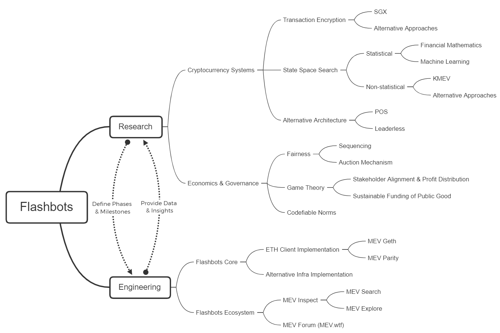

# Flashbots

Flashbots is a research and development organization formed to mitigate the negative externalities and existential risks posed by miner-extractable value (MEV) to smart-contract blockchains, starting with Ethereum. Our primary focus is to enable a *permissionless, transparent, and fair ecosystem* for MEV extraction. Flashbots arose out of the *MEV Pi-rate Ship*, a neutral, chain-agnostic, interdisciplinary research collective that supports MEV-related theoretical and empirical research. 

Flashbots is committed to open source. The best way to learn about Flashbots is to follow our progress in each repo. Find out more about Flashbots organization in our [medium post](https://medium.com/flashbots/frontrunning-the-mev-crisis-40629a613752) _Flashbots: Frontrunning the MEV-crisis_.

Flashbots research and development are tightly-coupled dual engines that propel Flashbots in a phased approach:
- **Long-term oriented research effort:** They spec out and update our roadmap, define our organization’s phases and identify key milestones associated with each of them;
- **Milestone-oriented engineering effort:** They are organized as product-focused teams that ship core infrastructure and ecosystem tools, while collecting data and producing other artifacts that feed back into research.

## Try Flashbots
  We have designed and implemented a proof of concept for permissionless MEV extraction called MEV-Geth. It is a sealed-bid block space auction mechanism for communicating transaction order preference. While our proof of concept has incomplete trust guarantees, we believe it's a significant improvement over the status quo. The adoption of MEV-Geth should relieve a lot of the network and chain congestion caused by frontrunning and backrunning bots. Find out more about Flashbots architecture and implementation in our [ethresearch post](https://ethresear.ch/t/flashbots-frontrunning-the-mev-crisis/8251).

- **Run MEV-Geth**
  If you are a miner or a mining pool, we invite you to review our code, try running MEV-Geth, and start mining MEV bundles today. 
    - [mev-geth](https://github.com/flashbots/mev-geth)
  This is a fork of go-ethereum. Install this binary, your revenue will go up even if it reduces PGAs, it won't affect your mining operations otherwise. The diff is 500 lines, so it's dead simple for you DYOR and verify what we said is true.
    - [mev-geth demo](https://github.com/flashbots/mev-geth-demo)
  A quick start on running an MEV GETH node, and shows how a miner may profit from it by accepting MEV bundles either via direct `block.coinbase` smart contract "bribes", or with extra transactions that pay the block's coinbase if it's known ahead of time.

- **Submit MEV-bundles**
  If you are a DeFi trader or run bots, we invite you to test out Flashbots and start submitting MEV bundles. Join our [Flashbots discord](https://discord.gg/3TjWjBerRb) community of MEV searchers, or contact us at info@flashbots.net

## Contribute to MEV-Research
  We invite you to review our [MEV-Research](https://github.com/flashbots/mev-research) repo to learn about our MEV Fellowship program. Start contributing through opening or answering a Github issue, and/or writing a Flashbots Research Proposal (FRP) to co-author our research papers and/or apply for a research grant, and join our discussion on our [MEV-Research discord](https://discord.gg/9yuuZendEy) community.

## Join the MEV party!

### MEV Roast
MEV Roast is a semi-monthly discussion that stems from the research collective MEV Pi-rate Ship tradition. It's meant to service as a communication bridge between Flashbots and the broader community interested in understanding MEV and contribute to our research and engineering efforts. The format of our Roast is meant to invite constructive criticism on the Flashbots efforts and to address open questions. 
| No. |Date | Roast Master | Agenda | Notes | Recording |
|:---|:---|:---|---|---|:---|
8 | Nov 25 | @danrobinson | [agenda](https://github.com/flashbots/pm/issues/1) | [slides](https://docs.google.com/presentation/d/1R0P-ypkiPJw-re0oKlkXkCF03UaVq_0fVnO9J0ewh1Q/edit?usp=sharing) | [video](https://drive.google.com/file/d/1bMwtTKtOITYr2DV_59RngOQADL4I3cWR/view?usp=sharing) |
9 | Dec 16 | Dan Elitzer | [agenda](https://github.com/flashbots/pm/issues/2) | [slides](https://docs.google.com/presentation/d/1fh-kdjnR-R6qpl3NE4wb6w2OAuMGBbSykKeCzM0ga6g/edit?usp=sharing) | [video](https://drive.google.com/file/d/1V2tJB6j7DVkQ9YKTShA5KACJNAk0kZje/view?usp=sharing) |

### Subscribe to MEV Ship Calendar
You can catch up on our latest community events by subscribing to the [MEV Ship Calendar](https://calendar.google.com/calendar/u/0/embed?src=c_7lurqn12ecl64li0ms3kse5vok@group.calendar.google.com): join us on our semi-monthly community call _MEV Roast_, our monthly Flashbots core dev call, weekly research workshop, and the upcoming unconference: MEV.wtf
