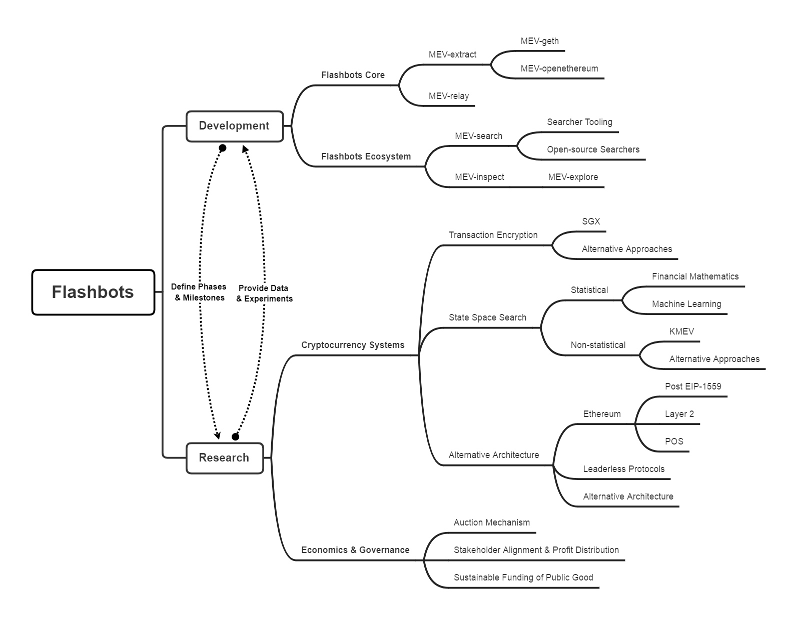

# Flashbots

Flashbots is a research and development organization working on mitigating the negative externalities of current MEV extraction techniques and avoiding the existential risks MEV could cause to state-rich blockchains like Ethereum. Our primary focus is to enable a permissionless, transparent, and fair ecosystem for MEV extraction. It falls under three goals: Democratizing Access to MEV Revenue, Bringing Transparency to MEV Activity and Redistributing MEV Revenue.

We've released two projects so far: 
* Flashbots Alpha: a proof of concept communication channel between miners and traders for transparent and efficient MEV extraction.
* MEV-Explore: a public dashboard and live transactions explorer of MEV activity.

You can interact with Flashbots on Discord and Github. We have dedicated channels on Discord for each of our efforts and welcome contributions. Our work is open source and you can follow our progress in each repository of the Flashbots organization. In addition, we hold several recurring community calls: a monthly MEV Roast, a bi-weekly research workshop and a monthly transparency call to update the community on our progress. 

The current repository you're in provides an overview of our activities, and contains our [open job searches](https://github.com/flashbots/pm/tree/main/jobs) and the [onboarding documents](https://github.com/flashbots/pm/tree/main/guides) to start using the Alpha we've released, either as a miner or as a trader.

Learn more about our values and our mission: [Flashbots - Frontrunning the MEV Crisis](https://medium.com/flashbots/frontrunning-the-mev-crisis-40629a613752)
  Join us on Discord: [#Flashbots](https://discord.gg/7hvTycdNcK)
  Subscribe to our public calendar [here](https://bit.ly/3uJAHpo)

### Index:
* [Introduction](https://github.com/flashbots/pm#flashbots)
* [Flashbots Alpha](https://github.com/flashbots/pm#flashbots-alpha)
* [MEV-Explore](https://github.com/flashbots/pm#mev-explore)
* [Our organization & ways you can contribute](https://github.com/flashbots/pm#our-organization)
* [List of resources, MEV Roasts recordings and how to navigate Flashbots' github](https://github.com/flashbots/pm#resources)

----
## Flashbots Alpha

On Jan 6th 2021, we entered the Flashbots Alpha phase by establishing a proof-of-concept communication channel between traders and miners. This proof-of-concept is made of two components: MEV-Geth, a slightly modified fork of the Ethereum Geth client, and MEV-Relay, a transaction bundle relayer.

**How it works:**
* A trader sends a Flashbots bundle to MEV-Relay. The bundle contains:
  * one or several transactions that can be the trader's and/or pending transactions in the mempool
  * a sealed tip that is paid to the miner
* MEV-Relay receives this bundle and sends it to all whitelisted MEV-Geth miners
* Miners receive Flashbots bundles through MEV-Geth. 
  * there can only be a single bundle per block
  * the Flashbots bundle will always be at the top slot of the block by design of the system.
* MEV-Geth picks which bundle to choose for each block.
  * MEV-Geth will pick the most profitable bundle for the miner.
  * MEV-Geth will compare the block that includes the bundle vs a vanilla Geth block, and will default back to the vanilla Geth block in case it is more profitable.
* Only when the trader's bundle is included in a block is the tip associated to their bundle paid.
  * a bundle that isn't included costs the sender nothing (ie. no gas fees are paid for failed transactions)

This infrastructure allows:
* traders to bypass the Ethereum mempool and avoid their strategy leaking before it is mined on-chain (i.e. being frontrun by generalized frontrunners)
* traders to save money from avoiding to pay gas fees for failed transactions.
* miners to receive additional revenue in the form of the bundle tip, in exchange for including the most profitable bundle in the block they mined.

Interested in learning more?
  [Onboard Flashbots alpha as a trader](https://github.com/flashbots/pm/blob/main/guides/flashbots-alpha.md)
  [Onboard Flashbots alpha as a miner](https://github.com/flashbots/pm/blob/main/guides/miner-onboarding.md)
  Read our [Jan 2021 Transparency Report](https://medium.com/flashbots/flashbots-transparency-report-january-2021-922514de8b8a)

We are quickly iterating in public towards a permissionless infrastructure with full transaction privacy. We welcome all ecosystem participants to provide early technical feedback via Github issues and pull requests in the relevant [repos](https://github.com/flashbots), create open-source toolings to improve transparency within Flashbots ecosystem, and participate in ongoing discussions on Flashbots' [Discord](https://discord.gg/3TjWjBerRb)!

## MEV-Explore

On Jan 22 2021, we released [MEV-Explore v0](https://explore.flashbots.net) a public dashboard and live transaction explorer for MEV transactions. 

How much MEV has been extracted on Ethereum? How much MEV do DeFi traders and bot operators capture? How much gas was spent on MEV transactions that went to the miners who mined the proof of work solutions with the MEV transactions? What are the most common types of MEV extraction strategies? Which DeFi protocols contain the most MEV? How much network resources do successful and failed MEV transactions take up?

With these questions in mind, we scraped Ethereum, covering over 8 major DeFi protocols and their clones, and collected more than 1.3 million MEV transactions that landed on-chain since Jan 1 2020 to provide a preliminary lower-bound to Extracted MEV. With the release of MEV-Explore, we're taking our first step at bringing transparency to MEV by quantifying the MEV that has been extracted on-chain.

[Quantifying MEV: Introducing MEV-Explore v0 (blogpost)](https://medium.com/flashbots/quantifying-mev-introducing-mev-explore-v0-5ccbee0f6d02)

## Our organization
Flashbots research and development are tightly-coupled dual engines that propel the organization in a phased approach:
- **Long-term oriented research efforts** spec out and update our roadmap, define our organization’s phases and identify key milestones associated with each of them;
- **Milestone-oriented engineering efforts** ship core infrastructure and ecosystem tools, while collecting data and producing other artifacts that feed back into research.

### Interested in contributing? 
We are not your typical project, we are fully remote and our principles are based on that of a [pirate hacker collective](https://www.youtube.com/watch?v=T0fAznO1wA8). If you are a self-directed individual who puts collective success above your own and are motivated by solving hard problems with asymmetric impact, you will fit right in. 

* [open job positions](https://github.com/flashbots/pm/tree/main/jobs) - full-time roles we're actively recruiting for.
* [flashbots research fellowship](https://github.com/flashbots/mev-research/blob/main/research_fellowship.md) - we issue research grants to flashbots research proposals submitters. Find out more in our research repo.
* flashbots part-time contractor - become a part-time contractor in Flashbots and join one of our ongoing projects. Reach out to the team to learn more!
* nothing fits in the above? reach out at info@flashbots.net 

## Resources

* [Flashbots: Frontrunning the MEV Crisis (medium)](https://medium.com/flashbots/frontrunning-the-mev-crisis-40629a613752)
* [Flashbots: Frontrunning the MEV crisis (EthR post)](https://ethresear.ch/t/flashbots-frontrunning-the-mev-crisis/8251)
* [Quantifying MEV: Introducing MEV-Explore v0](https://medium.com/flashbots/quantifying-mev-introducing-mev-explore-v0-5ccbee0f6d02)
* [explore.flashbots.net](https://explore.flashbots.net)
* [Flashbots Discord](https://discord.gg/7hvTycdNcK)
* [Flashbots Research vault](https://github.com/flashbots/mev-research#ship-vault)

### MEV Roast Recordings!

MEV Roast is a monthly discussion that stems from the research collective MEV Pi-rate Ship tradition. It's meant to service as a communication bridge between Flashbots and the broader community interested in understanding MEV and contribute to our research and engineering efforts. The format of our Roast is meant to invite constructive criticism on the Flashbots efforts and to address open questions. 
| No. |Date | Roast Master | Agenda | Notes | Recording |
|:---|:---|:---|---|---|:---|
8 | Nov 25 | @danrobinson | [agenda](https://github.com/flashbots/pm/issues/1) | [slides](https://docs.google.com/presentation/d/1R0P-ypkiPJw-re0oKlkXkCF03UaVq_0fVnO9J0ewh1Q/edit?usp=sharing) | [video](https://drive.google.com/file/d/1bMwtTKtOITYr2DV_59RngOQADL4I3cWR/view?usp=sharing) |
9 | Dec 16 | Dan Elitzer | [agenda](https://github.com/flashbots/pm/issues/2) | [slides](https://docs.google.com/presentation/d/1fh-kdjnR-R6qpl3NE4wb6w2OAuMGBbSykKeCzM0ga6g/edit?usp=sharing) | [video](https://drive.google.com/file/d/1V2tJB6j7DVkQ9YKTShA5KACJNAk0kZje/view?usp=sharing) |
10 | Jan 13 | Tom Schmidt / Palkeo | [agenda](https://github.com/flashbots/pm/issues/3) | [slides](https://docs.google.com/presentation/d/1G-mzdBUnEODZnNBhy8yppF2LBImVy9-F39FFCeypoAA/edit?usp=sharing) | [video](https://drive.google.com/file/d/1s7L4vToP5v5_j5rpqES8CYzyF7mOto5Z/view?usp=sharing) |
11 | Jan 28 | Sunny Aggarwal | [agenda](https://github.com/flashbots/pm/issues/6) | [slides](https://docs.google.com/presentation/d/1tvyDza7svyShgClosvAshg6qgs0LDIWiYwrPKGphnqQ/edit?usp=sharing) | [video](https://drive.google.com/file/d/1_4-E_i6WIDMNRDIgBIf0YiaJtm33XW9s/view?usp=sharing) |
12 | Feb 25 | Hudson Jameson | [agenda](https://github.com/flashbots/pm/issues/16) | [slides](https://docs.google.com/presentation/d/1I0cTl74p3MF_ZSyfjoH4A3YC6nJkK3_Ot302jiNPs5I/edit#slide=id.gbfd4392ce8_0_5) | [video](https://drive.google.com/file/d/1RLWCdvd47PHLN_az762r3G00BsnBumnb/view?usp=sharing) |

### Navigate Flashbots' Github
[/pm](https://github.com/flashbots/pm)
  The repo you're currently in, contains an introduction to our organization, our job postings and the list of all the projects we're working on, updated frequently by the project's owners.

[/mev-geth](https://github.com/flashbots/mev-geth)
  A fork of the Geth client dubbed MEV-Geth modified to accept Flashbots transaction bundles and to compare Flashbots blocks to regular blocks.

[/mev-geth-demo](https://github.com/flashbots/mev-geth-demo)
  Launches an MEV GETH node, and shows how a miner may profit from it by accepting MEV bundles

[/mev-relay-js](https://github.com/flashbots/mev-relay-js)
  The code for the entrypoint searchers send their Flashbots bundles to and miners connect to in order to receive bundles. Includes an example of a a reverse proxy that a miner can run.

[/ethers-provider-flashbots-bundle](https://github.com/flashbots/ethers-provider-flashbots-bundle)
  Flashbots provider for ethers.js

[/web3-flashbots](https://github.com/flashbots/web3-flashbots)
  Flashbots provider for web3.py 

[/simple-arbitrage](https://github.com/flashbots/simple-arbitrage)
  An example arbitrage bot that uses Flashbots.

[/mev-inspect-rs](https://github.com/flashbots/mev-inspect-rs)
  The Rust codebase of the inspectors we run to scrape Ethereum data we use in MEV-Explore.

[/mev-explore-public](https://github.com/flashbots/mev-explore-public)
  All things MEV-Explore: report bugs, request features by opening an issue and start a discussion in the discussion tab.

[/mev-research](https://github.com/flashbots/mev-research)
  All our research activity. Learn about our research organization, the MEV research fellowship, submit a Flashbots research proposal as a PR, open an issue to start a discussion.

